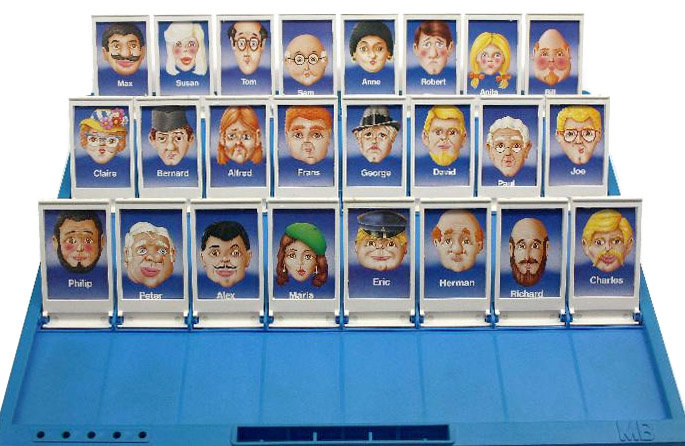
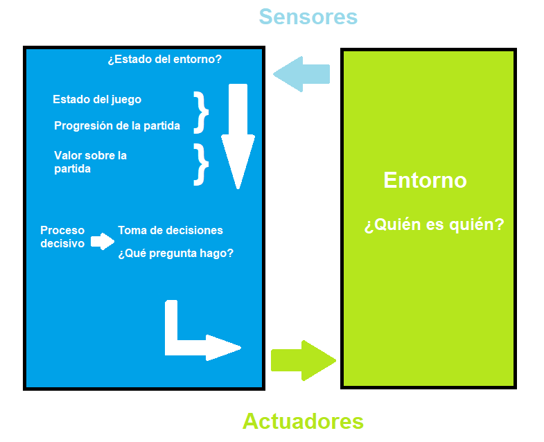

# ¿Quién es quién?
Agente que adivina en qué personaje estás pensando del famoso juego ¿Quién es quién?
- No puede preguntarte el (ambiguo) rasgo Género la primera vez
- Solo se basa en los rasgos físicos más definidos de los personajes

## Instalación
Antes de nada necesitaremos:
- Prolog:
https://www.swi-prolog.org/download/stable

[ ! ] Cuidado, a veces puede no añadirse al PATH correctamente

- Proyecto ¿Quién es quién?: recomendable ejecutar en Visual Studio Code, pero se puede utilizar el propio intérprete de prolog!

### Entorno
- Probado con la versión estable de prolog: SWI-Prolog 9.2.5-1

### ¿Cómo jugar?



- 1- Piensa en un personaje
- 2- Responde a las preguntas
- 3- Recibe el nombre de tu personaje en unas 6 pistas!

### Ejecutar desde la consola de Visual Studio Code
- Instalar extensión de Prolog (Peng Lv)
- Abrir terminal en el directorio de 'qq_data.pl'
- Escribir en la terminal:

```sh
swipl qq_data.pl
```

> Posible problema:  ¡Si no reconoce el comando swipl recuerda revisar el PATH!

#### Introducir PATH por consola (una sesión de terminal de uso):
```sh
 $env:Path += ";C:\Program Files\swipl\bin"
 ```

### Ejecutar TESTS
```sh
swipl tests.pl
```

## Preguntas pre-desarrollo

### 1. Optimización vs Búsquedas

Justifica por qué este juego puede considerarse un problema de optimización. Consulta la bibliografía recomendada.

#### Encaja en esta categoría porque buscamos encontrar el orden de preguntas que nos ayuda a minimizar los pasos necesarios para encontrar al personaje del adversario.

### 2. Entorno del agente

| Entorno de tareas | Completamente / parcialmente Observable | Agentes | Determinista / Estocástico | Episódico / Secuencial | Estático / Dinámico | Discreto / Continuo |
|-------------------|----------------------------------------|---------|----------------------------|------------------------|---------------------|---------------------|
| Quién es Quién    | Parcialmente Observable               | > 1       | Estocástico               | Secuencial             | Estático            | Discreto            |

### 3. Algoritmo

Usando programación en prolog iremos seleccionando posibles características que posee el personaje del rival. Optimizando nuestra secuencia de preguntas para ir reduciendo la muestra hasta poder acertar el personaje y ganar la partida.

Usando prolog para nuestro algoritmo podremos expresar este problema lógico de manera natural y eficiente.

### 4. Estructura del agente

Utilizaremos el correspondiente a un "Agente reactivo basado en modelos"



### 5. Programación lógica

Considerando que hacemos uso de reglas y restricciones, podemos aprovechar la lógica declarativa para resolver el problema de manera eficiente y clara.
El motor de inferencia de prolog es muy útil al lidiar con estos problemas de búsqueda y optimización, y por ende el paradigma de programación lógica.

### 6. Base de datos de Prolog

Cada personaje (sea rival o propio) del juego se trata de una instancia con características/variables (nombre + resto de características)
Esto nos ayuda a descomponer la consulta de objetivo de la lista de atributos que vamos a focalizar en nuestras preguntas a la hora de averiguar el resultado.

### BIBLIOGRAFÍA
- Inspiración para la frecuencia:
https://stackoverflow.com/questions/24101926/prolog-getting-frequency-of-list

- Estructura y ejemplos:
https://github.com/dfleta/quienesquien
https://www.youtube.com/watch?v=WagksXYJXPY&ab_channel=ArnauG%C3%B3mez
